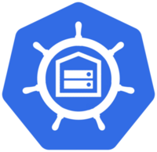

# [Homelab][homelab]

_my home infrastructure and Kubernetes cluster_

[![Built with nix][NIX-badge]][NIX-link]
[![K3S Version][K3S-badge]][K3S-link]
[![forgejo][forgejo-actions-badge]][forgejo-actions-link]
![Renovate][renovate-badge]

**Find all the information at**: https://jesusmtnez.es/homelab

  [NIX-badge]: https://img.shields.io/badge/Built_with_nix-blue.svg?logo=nixos&labelColor=73C3D5
  [NIX-link]: https://builtwithnix.org
  [K3S-badge]: https://img.shields.io/badge/v1.32-blue?&logo=k3s&logoColor=white
  [K3S-link]: https://k3s.io
  [forgejo-actions-badge]: https://codeberg.org/JesusMtnez/homelab/badges/workflows/site.yml/badge.svg?&logo=forgejo&logoColor=white&color=blue
  [forgejo-actions-link]: https://codeberg.org/JesusMtnez/homelab/src/branch/main/.forgejo/workflows/site.yml
  [renovate-badge]: https://img.shields.io/badge/passing-blue?logo=renovate&logoColor=white
  [homelab]: https://jesusmtnez.es/homelab
